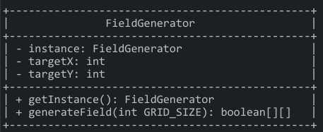

# M320_JavaProgrammierung

In Aufgaben befinden sich die Übungsaufgaben, welche in dem Modul M320 gelöst wurden.

# 3D Labyrinth Game

## Projektbeschreibung
Dieses Projekt ist ein 3D Labyrinthspiel, das mit der LWJGL engine (Lightweight Java Game Library) erstellt wurde. 

Der Spieler navigiert durch ein Labyrinth mit dem Ziel, die Zielfläche zu erreichen. 
Es wird dabei eine OpenGL-Umgebung verwendet, um das Spiel grafisch darzustellen.

Ziel ist es das Gelbe Feld zu suchen um ins Nächste Level zu kommen.

Hat man alle Level geschafft, dann steht in der Konsole die Zeit von dem Try.

## Einstellungen
Es ist möglich im Code gewisse Einstellungen vorzunehmen welche das spiel beeinflussen.
Alle Einstellungen sind in der RenderScreen zu finden:

	private static final int GRID_SIZE = 50;  - Grösse des Feldes.
	private final int MAX_LEVELS = 3;         - Levelanzahl.
	private final boolean FLY_MODE = false;   - Fliegen erlaubt oder verboten.
	private final float FOV = 45.0f;          - FOV an oder aus.
	private final float RENDER_DISTANCE = 250;- Weitsicht.
	private boolean TEXTURE_MODE = false;     - Texturmode

### Aufbau der Architektur
Das Spiel umfasst folgende Hauptkomponenten:
- **RenderScreen**: Stellt das Spielfeld und die Bewegungslogik dar.
- **Labyrinth**: Main klasse.
- **FieldGenerator**: Generiert das Spielfeld wie auch das Ziel zufällig.
- **FieldTexture und FieldColor**: Definieren die visuellen Eigenschaften und Farben des Spielfeldes.
- **Inputs**: Verarbeitet Benutzereingaben und aktualisiert die Position des Spielers.
- **GameOverException**: Spezielle Exception, die bei Abschluss des Spiels geworfen wird.

### Projektablauf
1. **Planung**: Erstellen des ersten Klassendiagramms und Beschreibung der Architektur.
2. **Implementierung**: Programmieren der einzelnen Klassen und Anwendung eines Design Patterns.
3. **Verfeinerung**: Spieltest und Debugging.

### Design Pattern: Singleton für FieldColor

Im Projekt wird das Singleton-Pattern für die "FieldColor"-Klasse verwendet, da nur eine Instanz dieser Klasse erforderlich ist, um die Farben der Spielfelder zu setzen. 

Das Singleton-Pattern verhindert die Erzeugung zusätzlicher Instanzen und kann Speicherplatz sparen.

### Klassendiagramm

### Usecasediagramm

